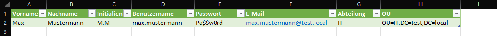

# Verwendung des Scripts


Verwende die template.csv als Vorlage. Aufgebaut ist die Vorlage wiefolgt: 

```Vorname, Nachname, Initialien, Benutzername, Passwort, E-Mail, Abteilung und OU```

Alle Werte bis auf dem Benutzernamen und der OU sind optionale Werte.
Wenn das Feld 'Passwort' leer gelassen wird, generiert das Script einen 12 Zeichen langes Passwort.
Die Länge der Passwörter kann durch das Argument ```'-PasswordLenth'``` verändert werden.

Den Wert 'OU' bestimmt den Anlageort des Benutzers. Die verfügbaren OUs können durch den folgenden PowerShell-Befehl aufgelistet werden:

```powershell
Get-ADObject -Filter { ObjectClass -eq 'organizationalunit' }
```


## Syntax

```powershell
.\script.ps1 -csvfile <Pfad zur CSV-Datei> -Domain <Lokale Domain>
```

## Beispiele

### PowerShell Script
```powershell
.\script.ps1 -csvfile .\template.csv -Domain vnext.local
```

```powershell
.\script.ps1 -csvfile .\template.csv -Domain vnext.local -PasswordLengh 18
```

### Template
</img>